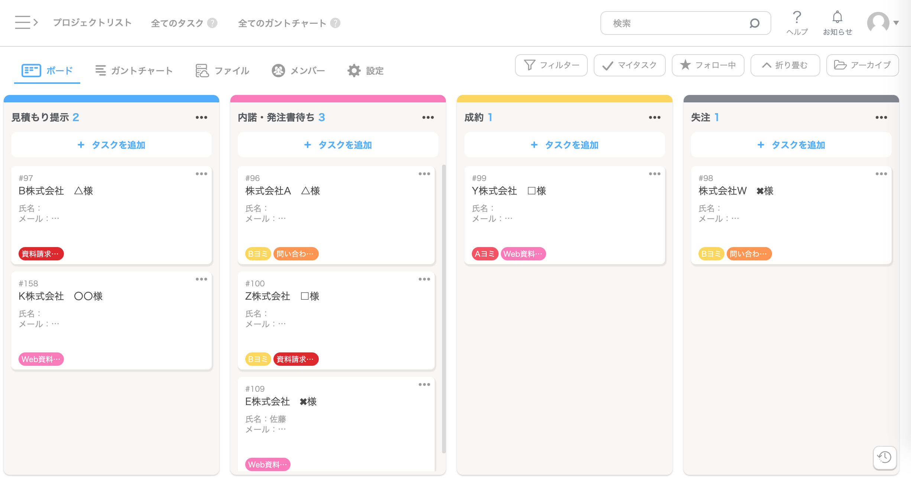

# AItam(ai-task-manager)
> **TeamsメンションからAIがタスクを自動抽出する、オフライン対応の3階層デスクトップタスク管理ツール**

---

## 1.概要・目的
- 作りたい理由  
  自身が使いやすいタスク管理ツールを求めているため
- 解決したい課題  
  Teamsで依頼されるタスク・メンションが埋もれて忘れる問題の解決  

---

## 2.ユーザー体験
- **手動操作**：タスクの追加・編集・削除
- **Teams連携**：自分へのメンションを自動で検知
- **AI分析**：AIが内容を分析し、タスクを自動判別・登録する

---

## 3.機能要件
### 基本仕様
- [ ] **タスク一覧画面**：プロジェクトやタスクを一覧・カンバンで管理
- [ ] **ローカル保存**：完全オフラインでもサクサク動くよう、データはPC内に安全に保存（SQLite）
- [ ] **秘密情報の保護**：パブリック開発のため、AIのAPIキーなどはコードに直書きせず `.env` による環境変数管理を徹底
- [ ] **カレンダー連携**：期限のあるタスクをカレンダー上で俯瞰できる機能

### 手動タスク管理
- **ステータス管理**：タスクは「未着手」「対応中」「完了」「保留」の4つの状態を持つ

### Teams連携&AI分析
- **検知対象**：グループ内のメンション、および個人間チャットのメッセージ
- **タスクプール機能**：AIが見つけたタスクは直接ボードに入れず、一度「インポートタスク（プール）」に溜めて、ユーザーが「追加・修正・却下」を選択・認証する承認フローを挟む
- **インテリジェント期限抽出**：メッセージ内に「明日まで」「来週中」などの曖昧な表現がある場合、AIに現在の日時も一緒に渡すことで、正確な日付（YYYY-MM-DD）へと自動計算・セットさせる

---

## 4.画面設計
### メイン画面
- **リボン**
  - 設定ボタン、およびアプリ全体の同期ステータスを表示。
- **ドロワーメニュー(左側)**
  - マウスホバーで展開する省スペース設計
  - 登録されたプロジェクト一覧(縦並び)・カレンダー・インポートタスク(プール)を配置
- **メインボード(中央)**
  - 選択されたプロジェクトのカンバンボード(未着手 / 対応中 / 完了)
  - カード表示内容：タスク名、期限、依頼者(Teams連携時はアイコンや名前)
- **詳細パネル(右側)**
  -折り畳み展開 or 右側に詳細パネル表示   
<イメージ画像>
  

### プールタスク
- 追加・修正・却下を選択
- 
### インタラクション
- **プロジェクト選択**: 左側でプロジェクトをクリックすると、中央のカンバンが該当プロジェクトのデータに超高速で切り替わる
- **サブタスク展開**: カンバン上のタスクをクリックすると、右側に詳細パネルで小項目が表示される。小項目はチェックボックスで管理
- **進捗連動**: サブタスクが100%完了にチェックされた際、親タスクのステータスを自動的に「完了」へ遷移させる(予定)

---

## 5.技術スタック
- **フロントエンド**：React
- **デスクトップ化**：Tauri or Electron
- **データベース**：SQLite
- **AI API**：OpenAI API (GPT-4o) or Anthropic API (Claude 3.5 Sonnet)

---

## 6.データモデル設計
### 大項目（プロジェクト）
- `id`：自動割り当ての識別番号
- `title`：プロジェクト名（例: アプリ開発）

### 中項目（タスク）
- `id`：自動割り当ての識別番号
- `title`：タスク名（例: README.md作成）
- `status`：ステータス（未着手・対応中・完了・保留）
- `deadline`：期限（日時・未設定OK）
- `project_id`：所属する大項目のID
- `source`：依頼主の名前
- `source_url`：Teams経由の場合、該当チャットに一瞬でジャンプするリンク
- `created_at`：タスクの追加日

### 小項目（サブタスク）
- `id`：自動割り当ての識別番号
- `title`：サブタスク名（例: 画面設計、データテーブル設計）
- `status`：ステータス（未着手・完了）をチェックボックスで管理
- `deadline`：期限（日時・未設定OK）
- `task_id`：所属する中項目のID
- `source`：依頼主の名前
- `source_url`：Teams経由のリンク
- `created_at`：サブタスクの追加日   

---

## 7.AI
期限抽出時、日時を確定させるために、現在の日時も渡す

---

## 8.項目
**大項目**：プロジェクト単位　　(例)アプリ開発  
**中項目**：タスク　　　　　　(例)README.md作成  
→小項目の完了から進捗を表示(完了数/サブタスク数)　進捗から自動で対応中・完了を設定   
**小項目**：サブタスク　　　　 (例)画面設計・データテーブル設計   
→折り畳み展開 or 右側に詳細パネル表示　完了/未完了のチェックで管理

---

## 9.ディレクトリ構成
ai-task-manager/  
├── .env                # AIのAPIキーやTeamsのURLを隠すファイル（GitHub非公開）  
├── .gitignore          # .env や node_modules をGitHubに上げないための設定  
├── README.md           # アプリの概要・設計図  
├── todo.md             # 進捗管理用のToDoリスト  
├── package.json        # アプリ全体の依存ライブラリ管理  
│  
├── src-tauri/          # デスクトップアプリ（Tauri）の設定・データベース領域  
│   ├── tauri.conf.json # Tauriの基本設定ファイル  
│   └── src/            # バックエンド（Rust/SQLite処理などが入る場所）  
│  
└── src/                # フロントエンド（React / 画面のコード）  
　├── main.jsx        # Reactの起動エントリーポイント  
　├── App.jsx         # アプリ全体のメインコンポーネント（リボンや全体の骨組み）   
　│  
　├── assets/         # 画像やアイコンなどの静的ファイル  
　│  
　├── components/     # 画面のパーツ（コンポーネント）を小分けにする場所  
　│   ├── Ribbon.jsx        # 上部の設定リボン  
　│   ├── Sidebar.jsx       # 左側のホバー式プロジェクト一覧・カレンダー  
　│   ├── MainBoard.jsx     # 中央のカンバンボード  
　│   ├── TaskCard.jsx      # カンバン内の1つ1つのタスクカード  
　│   ├── DetailPanel.jsx   # 右側からシュッと出る詳細・サブタスクパネル  
　│   └── TaskPool.jsx      # インポートタスク（プール）の画面パーツ  
　│  
　├── hooks/          # 画面の「動き」やデータ処理のロジックを分離する場所  
　│   ├── useTasks.js       # タスクの追加・編集・削除のロジック  
　│   └── useTeamsAI.js     # Teamsからの取得やAI分析を呼び出すロジック  
　│  
　└── styles/         # CSSなどのデザインファイル  
　　└── index.css   # 全体のスタイル設定  